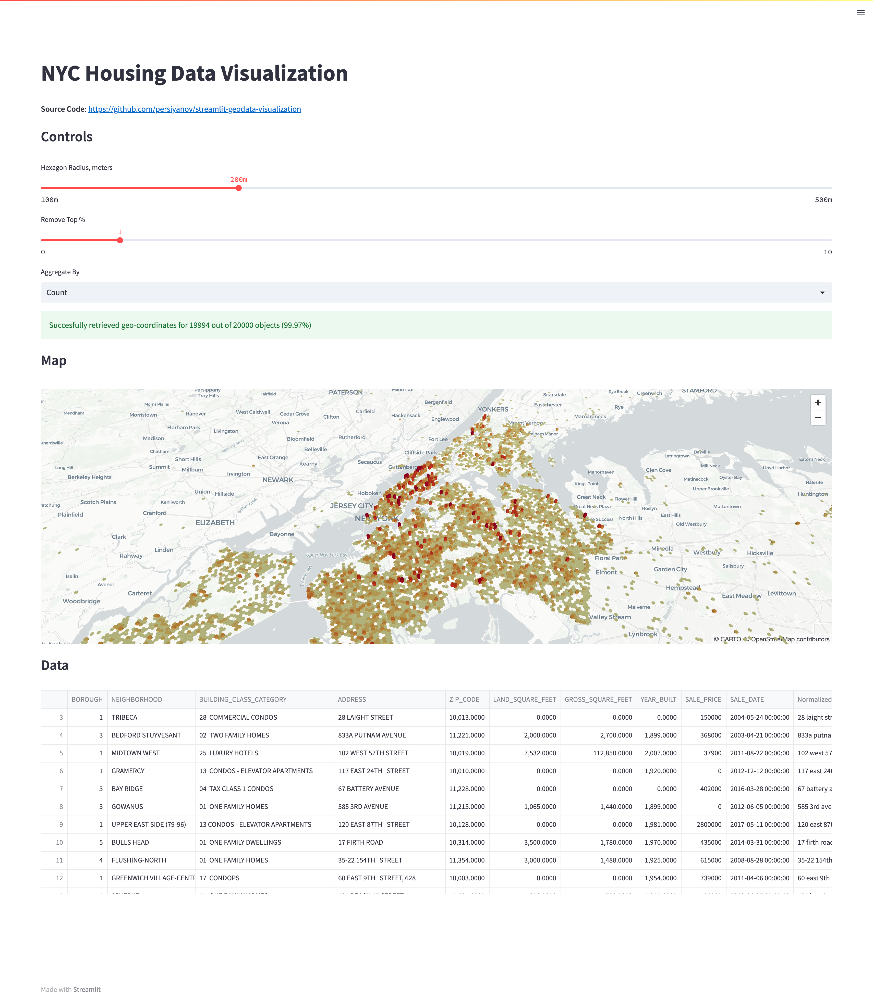

# Geospatial Data Visualization (Streamlit + Mapbox)

## Live Demo

**Available here:** https://streamlit-geodata-visualization-jyiexkhtva-lm.a.run.app/

## Description
This repo is a demonstration of parsing geo-coordinates from address data using Mapbox.com and visualizing via awesome [Streamlit](https://streamlit.io/) library.

Repo consists of two parts:

1. Geocoding of text addresses using Mapbox.com (see `scripts` folder)
2. Visualization of geocoded data using Streamlit and its pydeck integration (`streamlit_app.py`)

**Dataset**: [NYC-Housing-Data-2003-2019](https://www.openml.org/search?type=data&status=active&sort=match&id=43633)

## Setup
### Docker

1. Run `docker build -t geodata .`
2. Run `docker run -it -p 80:80 geodata`
3. Open http://127.0.0.1:80/

### Virtual Environment

1. Create virtual environment using your favorite tool (e.g. [pyenv](https://github.com/pyenv/pyenv)). I used Python 3.9.15 for development, but code should work for all 3.8+ versions.
2. Run `pip install -r requirements.txt`
3. Run `streamlit run streamlit_app.py`

## Deploy

1. Set up an account on [Google Cloud Platform](https://cloud.google.com/)
2. Install [gcloud cli](https://cloud.google.com/sdk/docs/install)
3. Run `gcloud run deploy` (deployment via Cloud Run)
4. **Note**: make sure to reply `y` when prompted `Allow unauthenticated invocations to [streamlit-geodata-visualization] (y/N)?`
